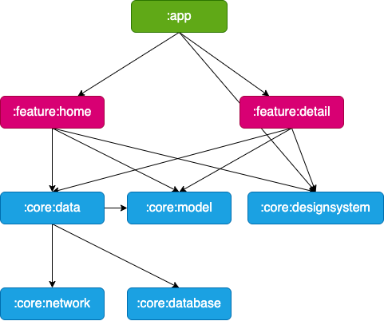

# Rickpedia

## Modularization

**Rickpedia** adopted modularization strategies below:

- **Reuseability**: Reusable code modules allow for appropriate code sharing opportunities while also limiting code accessibility in other modules.

- **Strict visibility control**: Modules limit the exposure of dedicated components and access to other layers, preventing them from being used outside of the module.

- **Decentralize focusing**: They can focus on their own modules by assign their dedicated modules

- **Parallel Execution**: Each module can be execute in parallel and it reduces the build time 

The Rickypedia app contains following types of modules:

- The `app` module - contains app level and scaffolding classes that bind the rest of the codebase such as `MainActivity`, `RickpediaApp`, and app-level controlled navigation.  

- `feature:` modules - feature specific modules which are scoped to handle a single responsibility in the app. These module can be reused by any app, including test or other flavoured apps, when needed while still keeping it separated and isolated. when a class is needed only by one `feature` module then it should remain within that module. If not, then should be extracted into an appropriate `core` module. A feature `module` should have no dependency on other features modules.

- `core:` modules - common library modules containing specific dependency that need to be shared between other modules in the app. These modules can depend on other core modules and shouldn't depend on feature nor app modules.

- Miscellaneous modules - such as `test` modules

For further information, check out the [Guide to Android app modularization](https://developer.android.com/topic/modularization)

## Modules

Using the above modularization strategy, the Rickpedia app has the following modules

| Name                 | Responsibility                                                                                                        |
| -------------------- | --------------------------------------------------------------------------------------------------------------------- |
| `:app`               | Brings everything together for the app to function correctly including UI scaffolding and navigation                  |
| `:feature:home`      | Display lists all available character on the HomeScreen                                                               |
| `:feature:detail`    | Display details of the character such as gender, location, origin, episode, and image, on the DetailScreen            |
| `:core:model`        | Model classes used throughout the app                                                                                 |
| `:core:designsystem` | Design Foundation (Typography, ColorScheme, Spacings, Theme, Shapes), common composable components, common resources. |
| `:core:data`         | Fetching app data from multiple sources, shared by different features                                                 |
| `:core:network`      | Making network request and handling response from a remote data source                                                |
| `:core:database`     | Local database storage                                                                                                |

## Architecture

**Rickpedia** isa based on the MVVM architecture and the Repository pattern which follows the [Guide to app architecture](https://developer.android.com/topic/architecture)

TBD
